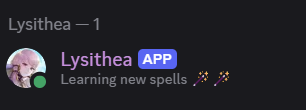
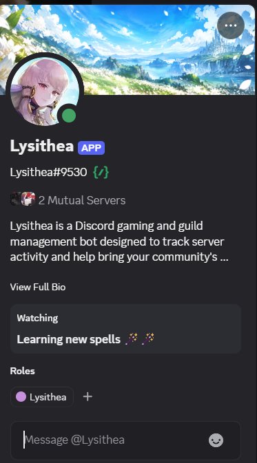
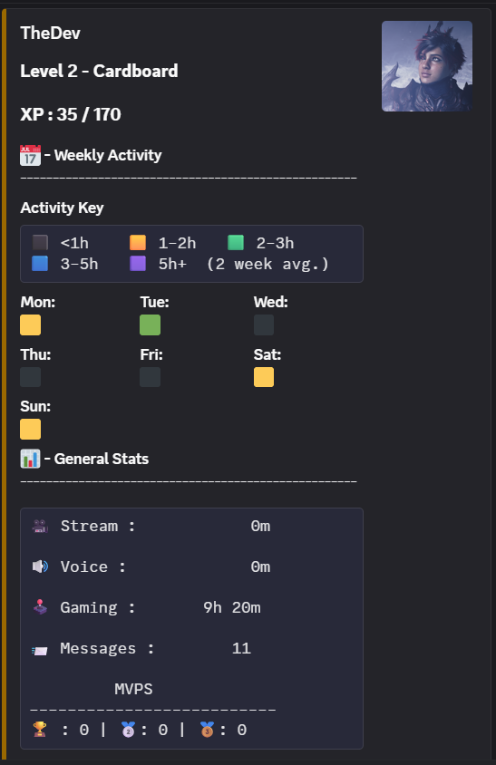
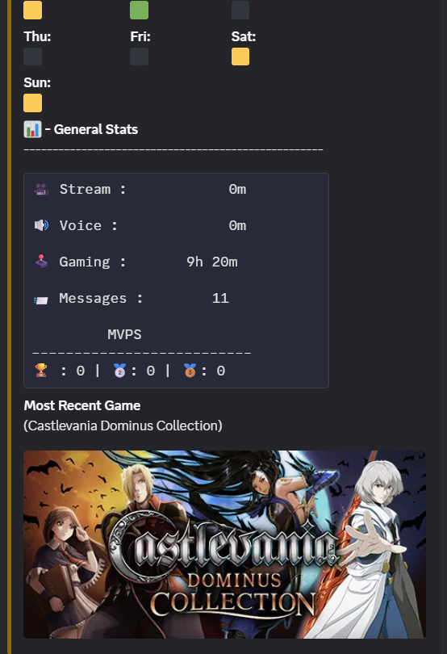
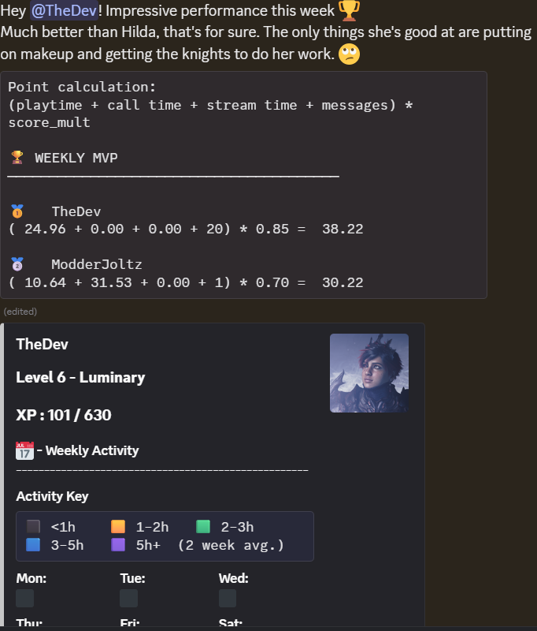
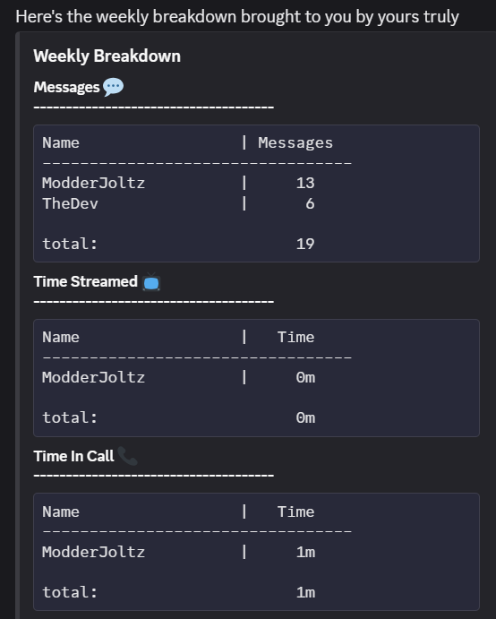
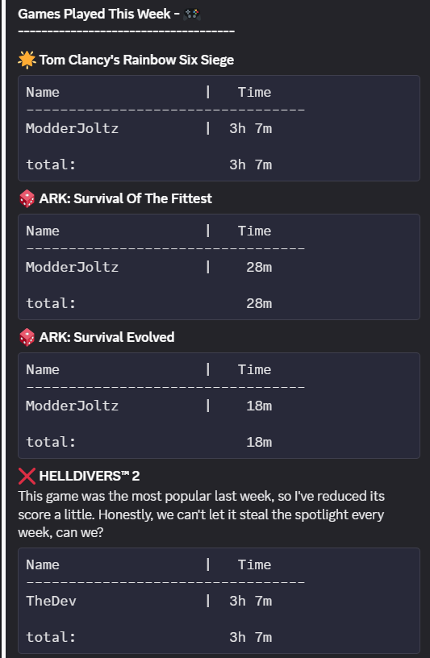
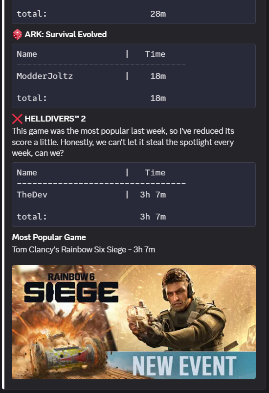
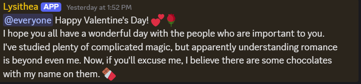

# Lysithea

A Discord bot for tracking gaming activity, managing guild statistics, and bringing a little personality to a small gaming community.

Lysithea was built as a personal portfolio project using Python, Discord.py, PostgreSQL, and the Steam Web API. The bot automatically keeps track of members' activity, records gaming statistics, awards XP, and selects a weekly MVP based on server activity.

## ✨ Features

### 👤 Profiles & Steam Integration

* **Guild Cards** — View a member's level, XP, games, activity, and Steam information.
* **Steam Account Linking** — Link a Steam account using its public Steam ID.
* **Automatic Steam Sync** — Linked accounts can be synchronized once per day.
* **Steam Privacy Support** — The bot only accesses information visible to the bot owner.
* **Game History** — Previously recorded games remain in the server's records even if a Steam account is later unlinked.

### 🎮 Activity & XP

Lysithea automatically tracks activity in the background without requiring users to manually start or stop sessions.

Activity that can contribute to XP and statistics includes:

* Playing games
* Voice calls
* Streaming
* Discord messages
* Other supported Discord activities

Game activity can be recorded directly from Discord presence information. Steam can also be used to record game playtime when the appropriate profile information is accessible.

### 🏆 Weekly Statistics & MVP

At the end of each week, Lysithea calculates server activity and selects an MVP.

Weekly statistics include:

* Games played
* Game time
* Voice activity
* Streaming
* Messages

MVP scoring is based on:

* **6 points/hour** of streaming
* **3 points/hour** in voice calls
* **2 points/hour** of gaming

Games that were especially popular during the previous week receive a small penalty to prevent the most commonly played games from dominating the rankings.

XP uses a similar activity-based system without the popularity penalty.

### 📰 Game News

Lysithea periodically checks the games being played by members and looks for relevant game news.

The bot filters results to avoid flooding the server and keeps track of previously posted articles so the same news isn't repeatedly posted.

### 🎉 Holidays & Special Events

Lysithea can also send announcements for holidays and other special occasions.

Because apparently even a game-tracking bot needs to know when it's Christmas.

---

## 🛠️ Technologies

* **Python**
* **discord.py**
* **PostgreSQL**
* **psycopg2**
* **Steam Web API**
* **IGDB / Twitch API**
* **python-dotenv**
* **Railway**
* **pgAdmin**

---

## 🗄️ Database

Lysithea uses PostgreSQL to store both global user information and server-specific data.

The database separates information such as:

* Discord users
* Guilds
* Guild memberships
* Games
* User/game relationships
* Steam information
* Activity logs
* Weekly statistics

This allows a user's global information, such as their linked Steam account, to be shared across multiple servers while keeping server-specific progression and statistics separate.

---

## ⚙️ Architecture

The bot uses Discord.py's asynchronous event and task system to handle activity tracking and background operations.

Some operations that would otherwise block the Discord event loop, such as database and external API calls, are moved into worker threads where appropriate.

Background tasks are also used for operations such as:

* Daily Steam synchronization
* Game news retrieval
* Weekly statistics processing
* MVP calculation
* Periodic maintenance

The project was designed around keeping the implementation relatively simple while still being reliable enough to run continuously on a hosted server.

---

## 🔒 Steam Privacy

Lysithea does **not** receive access to a user's Steam account credentials.

Users only provide their public Steam ID. The bot cannot:

* Log into a Steam account
* View a Steam password
* Change a Steam account
* Access information hidden by Steam's privacy settings

Steam information is only retrieved when it is visible to the bot owner's Steam account.

Automatic Steam synchronization runs once per day rather than continuously monitoring users' Steam accounts.

---

## 🚀 Running Locally

### Requirements

* Python 3.x
* PostgreSQL
* A Discord bot application
* Steam Web API access
* IGDB/Twitch API credentials

### Environment Variables

Create a `.env` file containing the required credentials and database configuration:

```env
DISCORD_TOKEN=your_discord_token

DB_HOST=your_database_host
DB_NAME=your_database_name
USER=your_database_user
PASSWORD=your_database_password
PORT=your_database_port

STEAM_API_KEY=your_steam_api_key

TWITCH_CLIENT_ID=your_twitch_client_id
TWITCH_CLIENT_SECRET=your_twitch_client_secret
IGDBTOKEN=your_IGDB_token

DEV_ID = (This could be your steam account. If you don't have one use any nubers)
DEV_DISCORD = (This could be your discord id. If you don't have one use any nubers)
```

How to get Steam credentials : https://steamcommunity.com/dev
How to get IGDB credentials : https://api-docs.igdb.com/#getting-started

---

## 📋 Commands

| Command              | Description                                       |
| -------------------- | ------------------------------------------------- |
| `/guildcard`         | View your own or another member's guild card      |
| `/link_steam`        | Link a Steam account                              |
| `/unlink_steam`      | Remove your linked Steam account                  |
| `/toggle_steam_sync` | Enable or disable automatic Steam synchronization |

Most activity tracking happens automatically in the background, so users don't need to manually manage sessions.

---

## 📁 Project Goals

Lysithea started as a relatively small Discord bot for a private gaming server and gradually grew into a larger project involving:

* Asynchronous programming
* Database design
* Event-driven programming
* Background task scheduling
* External API integration
* Discord permissions and intents
* Data validation
* Error handling
* Deployment and database management

The project was built both as a useful bot for a small community and as an opportunity to practice building and maintaining a complete application from development through deployment.

---

## 👤 Author

Built by **Pius Omolewa** as a personal project.

---
## 📷 Media












